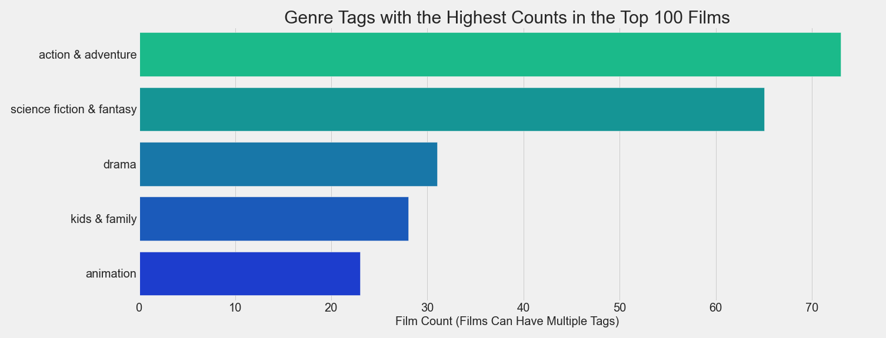

# Microsoft Box Office Insights

**Author:** Jeffrey Hanif Watson
***

## Overview

This project provides a broad overview of the contemporary film industry as well as recommendations with regards to the probable initial capital requirements and film genres that will offer a high probability to maximize profit and return on investment. Descriptive analysis was performed on data obtained from the [The Numbers](https://www.the-numbers.com/), [Rotten Tomatoes](https://www.rottentomatoes.com/), and the [IMDb](https://www.imdb.com/) to arrive at the following conclusions: 

- The estimated cost for production and marketing in the first year: 3,881,250,000 USD.
- The bulk of film revenue will come from the international market.
- The Big Five genres of Action, SciFi, Drama, Family, and Comedy offer the best chances to maximize  profits.
- The Hidden Value genres of Comedy, Horror, Mystery, and Drama have the highest probability for optimal return on investment.


## Business Problem

According to data from [The Numbers](https://www.the-numbers.com/), the US box office has increased  from 5.3 billion USD in 1995 to 11.3 billion USD in  2019. Identifying opportunities with the highest probability for profit and ROI in this steadily growing market is the strategic priority. Variables highlighted for analysis include production cost, gross profit, net profit, return on investment, and the ratio of domestic to foreign box office receipts.


## Data

Data aggregated from [Rotten Tomatoes](https://www.rottentomatoes.com/) provided a solid foundation to analyze overall box office trends, genre trends, and individual films. [IMDb](https://www.imdb.com/) data was better formatted to research actors, directors, writers, and producers. Numerical data from [The Numbers](https://www.the-numbers.com/) was joined with the datasets above to create a data frame of 4,776 films and a complimentary data frame of 32,088 individuals. 

## Methods

SQLite, Python, Pandas, and Seaborn were used for data preparation, analysis and visualization.

## Results

### Estimating Inital Costs

Based on data from [The Numbers](https://www.the-numbers.com/). The top six studios release, on average, fifteen films per year. The median production cost of top grossing film is 172,500,000 USD, and a rough estimate of the marketing budget for a film is half of the production budget. Running a calculation on these figures gives an intial cost estimate of **3,881,250,000 USD** for the first year's films.

## Market Trends

### Distribution of the Top 100 Grossing Films


### Mean Budget For a Top 100 Grossing Film


### Mean Share of Gross From Outside US


## Genre Analysis

### The Big Five Genres Offer The Highest Gross Profits


### Hidden Value Genres Offer The Best Return On Investment


## Conclusions

**Recap:**
- Estimated initial cost: 3,881,250,000 USD.
- Most revenue will come from the international market.
- The Big Five genres increase the chance of maximum gross profits.
- Hidden Value genres have a increase probability of a high ROI.
**Next Steps:**
- Analysis of creative talent was performed and is available upon request.
- Incorporate the streaming market into the analysis.
- Research purchase of a production company rather than starting from scratch.


## For More Information

Please review our full analysis in [our Jupyter Notebook](MS_Box_Office_Insights.ipynb) or our [presentation](./presentation.pdf).

For any additional questions, please contact **Jeffrey Hanif Watson** at **jeffrey.h.watson@protonmail.com**

## Repository Structure

```
├── MS_Box_Office_Insights.ipynb
├── README.md
├── create_sql_database.ipynb
├── data
│   ├── movies.db
│   └── zippedData
│       ├── bom.movie_gross.csv.gz
│       ├── imdb.name.basics.csv.gz
│       ├── imdb.title.akas.csv.gz
│       ├── imdb.title.basics.csv.gz
│       ├── imdb.title.crew.csv.gz
│       ├── imdb.title.principals.csv.gz
│       ├── imdb.title.ratings.csv.gz
│       ├── rotten_tomatoes_critic_reviews.csv.gz
│       ├── rotten_tomatoes_movies.csv.gz
│       ├── tmdb.movies.csv.gz
│       └── tn.movie_budgets.csv.gz
├── images
│   ├── 12_scifi_stats.png
│   ├── 13_drama_stats.png
│   ├── 14_family_stats.png
│   ├── 17_horror_stats.png
│   ├── 18_comedy_stats.png
│   ├── 1_100_grossing_films.png
│   ├── 23_mystery_stats.png
│   ├── 2_average_budgets.png
│   ├── 3_100_gross_stats_slim.png
│   ├── 5_percent_international.png
│   ├── 6_100_genre_counts.png
│   ├── 8_top_roi_genres.png
│   ├── blueprint.png
│   ├── director_shot.jpeg
│   ├── movies_db_schema.png
│   ├── pandas-logo.png
│   ├── python-logo.png
│   ├── seaborn-logo.png
│   ├── sqlite-logo.png
│   └── viz1.png
├── presentation.pdf
└── src


```